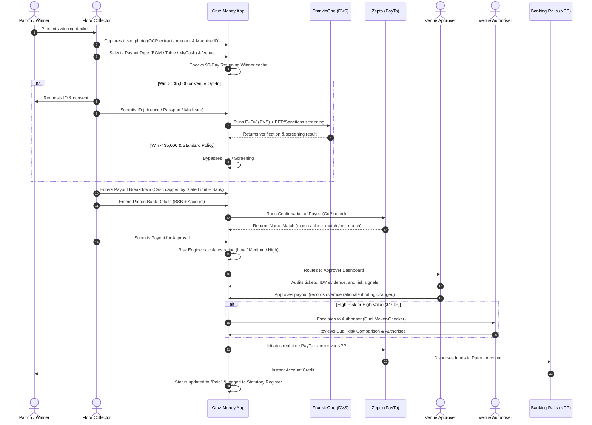

# Cruz Money (Riverside Payouts) — Complete System Architecture & Functional Specification (A to Z)

**Document Version:** 1.0  
**Target Platform:** Cruz Money Jackpot & Gaming Payout Engine  
**Jurisdiction:** Commonwealth of Australia (AUSTRAC & State Gaming Regulators)  
**Date:** September 2026  

---

## Table of Contents
1. [Executive Summary & Purpose](#1-executive-summary--purpose)
2. [Regulatory & Compliance Context](#2-regulatory--compliance-context)
3. [System Actors & Role Hierarchy](#3-system-actors--role-hierarchy)
4. [End-to-End Payout Lifecycle](#4-end-to-end-payout-lifecycle)
5. [Compliance, IDV & Screening Engine](#5-compliance-idv--screening-engine)
6. [Regional Cash Limits & Statutory Regulations](#6-regional-cash-limits--statutory-regulations)
7. [Automated Risk Rating Engine & Dynamic Maker-Checker](#7-automated-risk-rating-engine--dynamic-maker-checker)
8. [Payment Rails, PayTo & Banking Integration](#8-payment-rails-payto--banking-integration)
9. [Back-Office Administration & Multi-Tenancy](#9-back-office-administration--multi-tenancy)
10. [Audit, Reporting & AUSTRAC SMR Filings](#10-audit-reporting--austrac-smr-filings)
11. [Technical Architecture & Integrations](#11-technical-architecture--integrations)
12. [A to Z Glossary of Terms & Acronyms](#12-a-to-z-glossary-of-terms--acronyms)

---

## 1. Executive Summary & Purpose

**Cruz Money** (deployed in this project as *Riverside Payouts*) is a specialized, enterprise-grade Anti-Money Laundering (AML) compliance and digital payout disbursement platform designed for the Australian hospitality and gaming industry (clubs, pubs, RSLs, and casino lounges).

### The Problem It Solves
Historically, gaming machine (EGM) jackpot and high-value gaming payouts in Australian venues relied on manual, paper-heavy, cash-based workflows:
- Large cash payouts on gaming floors created severe armed robbery, cash handling, and money laundering risks.
- Physical identity checks by venue floor staff were error-prone, vulnerable to fraudulent or expired identification documents, and lacked digital audit trails.
- State-specific gaming regulations (e.g., Victoria's strict \$2,000 cash cap vs New South Wales' \$5,000 limit) were difficult to enforce consistently across multi-venue groups.
- Federal AUSTRAC reporting requirements for payouts exceeding the \$5,000 AML threshold or involving Politically Exposed Persons (PEPs) and sanctioned entities were frequently missed or delayed due to disconnected systems.

### The Cruz Money Solution
Cruz Money digitizes and automates the entire process from gaming floor ticket redemption to real-time bank settlement:
1. **Captures and parses** winning tickets via OCR or direct machine inputs.
2. **Performs real-time biometric and electronic ID verification (E-IDV)** directly against Australian government databases (DVS).
3. **Conducts automated AML screening** against global PEP, sanctions, and adverse media watchlists.
4. **Enforces statutory state gaming cash caps** and prevents illegal cash payouts.
5. **Executes Confirmation of Payee (CoP)** bank account name matching to prevent fraudulent transfers.
6. **Calculates an automated system risk rating** (Low, Medium, High) with dynamic multi-tier approval routing.
7. **Disburses funds in real time** via Australia's New Payments Platform (NPP) using Zepto PayTo agreements.
8. **Generates statutory gaming registers** and pre-fills AUSTRAC Suspicious Matter Reports (SMR).

---

## 2. Regulatory & Compliance Context

Cruz Money is engineered to ensure strict compliance with two converging layers of Australian law:

### A. Federal Level: AUSTRAC AML/CTF Obligations
Under the *Anti-Money Laundering and Counter-Terrorism Financing Act 2006 (AML/CTF Act)*:
- **Designated Services:** Gaming floor cash payouts and account transfers constitute designated financial services.
- **$5,000 AML Threshold:** Any payout of \$5,000 AUD or greater triggers mandatory Customer Due Diligence (CDD) — full identity verification, watchlist screening, and record-keeping for 7 years.
- **Suspicious Matter Reporting (SMR):** If staff or automated systems suspect that a transaction involves proceeds of crime, tax evasion, or money laundering, an SMR must be reported to AUSTRAC within 24 hours (terrorism financing) or 3 business days (general AML).
- **PEP & Sanctions Screening:** Mandates identifying foreign/domestic politically exposed persons and cross-checking against DFAT (Department of Foreign Affairs and Trade) and OFAC sanctions lists.

### B. State & Territory Level: Gaming Legislation & Cash Caps
Each Australian state tightly regulates floor cash payouts to minimize gambling harm and prevent illicit money cycling:
- **Victoria:** *Gambling Regulation Act 2003* — Cash payouts capped at **\$2,000 AUD**. The remainder must be EFT or cheque.
- **New South Wales:** *Gaming Machines Act 2001* — Cash payouts capped at **\$5,000 AUD**.
- **Australian Capital Territory:** *Gaming Machine Act 2004* — Cash payouts capped at **\$1,200 AUD**.
- **Northern Territory:** *Gaming Control Act 1993* — Cash payouts capped at **\$500 AUD**.
- **Queensland:** *Gaming Machine Act 1991* — No statutory fixed ceiling; venues set their floor cash limit in their approved Internal Control System (ICS), typically defaulting to **\$1,000 AUD**.
- **South Australia:** *Gaming Machines Act 1992* — Cash capped at **\$2,000 AUD**.
- **Tasmania:** *Gaming Control Act 1993* — Cash capped at **\$1,500 AUD**.
- **Western Australia:** EGMs are prohibited outside Crown Perth Casino; pub/club cash limits are not applicable.

---

## 3. System Actors & Role Hierarchy

```
┌────────────────────────────────────────────────────────────────────────────┐
│                         Cruz Money Role Hierarchy                          │
├─────────────────┬──────────────────────────────────────────────────────────┤
│ Super Admin     │ Global platform operator, client onboarding, billing,     │
│                 │ cross-venue SMR oversight, system risk engine policies    │
├─────────────────┼──────────────────────────────────────────────────────────┤
│ Venue Admin     │ Venue manager/IT, machine registry, local cash limits,    │
│                 │ staff assignments, OCR docket template configuration     │
├─────────────────┼──────────────────────────────────────────────────────────┤
│ Authoriser      │ Senior finance / general manager, secondary sign-off     │
│                 │ on escalated high-value or high-risk payouts             │
├─────────────────┼──────────────────────────────────────────────────────────┤
│ Approver        │ Venue duty manager/supervisor, review IDV & screening,   │
│                 │ risk assessment, override justifications, SMR filing     │
├─────────────────┼──────────────────────────────────────────────────────────┤
│ Collector       │ Floor staff, scans ticket, captures patron identity,     │
│                 │ inputs bank details, triggers electronic verification    │
├─────────────────┼──────────────────────────────────────────────────────────┤
│ Patron / Winner │ The customer receiving funds (interacts via Collector)   │
└─────────────────┴──────────────────────────────────────────────────────────┘
```

1. **Patron / Winner:** The customer on the venue floor. Does not log into the application directly; interacts with the Collector on floor tablets or counter kiosks.
2. **Collector (Floor Staff):**
   - Initiates payout on a tablet/mobile terminal.
   - Uploads or snaps winning ticket photos (processed via client-side OCR).
   - Records patron details (Name, DOB, Address, Contact Info).
   - Obtains patron statutory consent and submits identity documents for E-IDV.
   - Enters bank details (BSB and Account Number) for Zepto Confirmation of Payee (CoP).
3. **Approver (Venue Supervisor / Duty Manager):**
   - Reviews submitted payouts in real time on the Approver Dashboard.
   - Audits uploaded physical ticket legibility (4 corners, barcode, transaction ID).
   - Reviews FrankieOne E-IDV verification outcomes and screening hits (PEP/Sanctions).
   - Inspects the system-generated automated risk rating.
   - Exercises supervisory override if necessary (requires mandatory written audit rationale).
   - Pre-populates and files AUSTRAC Suspicious Matter Reports (SMR) via the swivel-chair portal.
4. **Authoriser (Senior Management / Finance):**
   - Serves as the second check in the dual maker-checker workflow for high-risk or high-value payouts.
   - Compares the automated system risk evaluation against the Approver’s determination.
   - Authorizes the final release of funds to the banking system.
5. **Venue Administrator:**
   - Configures venue-specific settings (cash limits, minimum delay wait times, daily payout caps).
   - Manages EGM gaming machine registry and locations.
   - Configures OCR docket parsing schemas.
6. **Super Administrator:**
   - Manages parent organizations (Clients/Groups) and multi-venue tenancies.
   - Configures global billing tiers, platform-wide risk scoring thresholds, and national AML audit logs.

---

## 4. End-to-End Payout Lifecycle



### Complete State Machine Transitions
```
draft ──► review ──► authorise_required ──► authorise_approved
                           │                       │
                       (Rejected)                  ▼
                           │               payment_delayed ◄───(Retry Loop: Daily Limit / Wait Hours)
                           ▼                       │
                        failed             payto_payment_created
                                                   │
                                           payto_payment_success
                                                   │
                                            payment_created
                                                   │
                                    ┌──────────────┴──────────────┐
                                    ▼                             ▼
                                  paid 🗸                        failed ✗
```

---

## 5. Compliance, IDV & Screening Engine

### Electronic Identity Verification (E-IDV) Workflow
Identity verification is orchestrated through FrankieOne integrations with the Australian Document Verification Service (DVS):

1. **Document Types Supported:**
   - **Australian Driver’s Licence:** State, licence number, card number, expiry date.
   - **Australian Passport:** Passport number, nationality, gender, expiry date.
   - **Medicare Card:** Card number, Individual Reference Number (IRN), card color (Green/Blue/Yellow), expiry date.
2. **Statutory Consent Triple-Lock:**
   Before DVS checks can execute, floor collectors must obtain three distinct affirmations:
   - `consent.general`: General authorization to verify identity.
   - `consent.docs`: Authorization to verify documents against official issuer databases.
   - `consent.creditheader`: Credit bureau identity cross-match consent.
3. **Tiered IDV Verification Paths:**
   - **IDV1 (Clean Automated Pass):** Primary document passes DVS electronically. Risk assigned: **Low**.
   - **IDV2 (Second Primary Document):** First document fails DVS; patron provides a second government document which passes. Risk assigned: **Medium**.
   - **IDV3 (Secondary Manual Capture):** Electronic checks fail; Collector physically inspects a secondary document, checks the *Digital Attestation Checkbox* ("I have physically viewed and verified this document"), and submits photos for supervisor review. Risk assigned: **High**.
   - **No-ID Exception:** Patron cannot produce identification. Requires manual supervisor interview, mandatory supervisor override, and triggers immediate **High** risk rating.

### Watchlist & Adverse Media Screening
Simultaneously with E-IDV, FrankieOne executes full watchlist queries:
- **Politically Exposed Persons (PEP):**
  - *Class 1 (Foreign & Diplomatic):* Heads of state, ambassadors. Triggers immediate **High** risk.
  - *Class 2/3 (Domestic & Municipal):* Australian MPs, local councillors. Triggers **Medium** risk.
- **Sanctions Screening:** Live screening against Australian DFAT, US OFAC, UN, and UK sanctions lists. Any active match triggers immediate **High** risk and locks payout for compliance review.
- **Adverse Media:** Real-time web and media scanning for financial crime, drug offenses, or fraud associations.

### 90-Day Returning Winner Policy
To balance compliance rigor with player convenience on gaming floors:
- If a patron wins multiple jackpots at the same venue within **90 days**, and their initial payout had a verified clean E-IDV (not a manual No-ID exception), the system bypasses IDV and screening.
- **Confirmation of Payee (CoP)** remains strictly mandatory on every payout to ensure bank accounts have not changed.

---

## 6. Regional Cash Limits & Statutory Regulations

Cruz Money enforces Australian state-specific gaming cash payout limits in real time through its compliance gate (`complianceGate.js`):

```
┌─────────────┬───────────────────────────┬─────────────────────────────────────────────────────────┐
│ State / Reg │ Statutory Cash Limit      │ Governing Act & Enforced Behavior                       │
├─────────────┼───────────────────────────┼─────────────────────────────────────────────────────────┤
│ NSW         │ $5,000.00 AUD             │ Gaming Machines Act 2001 (cl. 122)                      │
│             │                           │ Cash up to $5k permitted; balance must be EFT / cheque   │
├─────────────┼───────────────────────────┼─────────────────────────────────────────────────────────┤
│ VIC         │ $2,000.00 AUD             │ Gambling Regulation Act 2003 (§ 3.4.40)                 │
│             │                           │ Strict $2,000 floor cap; excess blocked from cash       │
├─────────────┼───────────────────────────┼─────────────────────────────────────────────────────────┤
│ ACT         │ $1,200.00 AUD             │ Gaming Machine Act 2004 (§ 40)                          │
│             │                           │ Maximum $1,200 cash redemption                          │
├─────────────┼───────────────────────────┼─────────────────────────────────────────────────────────┤
│ NT          │ $500.00 AUD               │ Gaming Control Act 1993 (Code of Practice)              │
│             │                           │ Strict $500 cash payout limit                           │
├─────────────┼───────────────────────────┼─────────────────────────────────────────────────────────┤
│ QLD         │ Venue-Configured (Default │ Gaming Machine Act 1991                                 │
│             │ $1,000.00 AUD)            │ Venue sets cash ceiling in approved Internal Control    │
├─────────────┼───────────────────────────┼─────────────────────────────────────────────────────────┤
│ SA          │ $2,000.00 AUD             │ Gaming Machines Act 1992 (§ 53A)                        │
│             │                           │ Maximum $2,000 cash payout                              │
├─────────────┼───────────────────────────┼─────────────────────────────────────────────────────────┤
│ TAS         │ $1,500.00 AUD             │ Gaming Control Act 1993                                 │
│             │                           │ Maximum $1,500 cash payout                              │
├─────────────┼───────────────────────────┼─────────────────────────────────────────────────────────┤
│ WA          │ N/A (Null)                │ Gaming and Wagering Commission Act 1987                 │
│             │                           │ EGMs banned in clubs/pubs; casino only                  │
└─────────────┴───────────────────────────┴─────────────────────────────────────────────────────────┘
```

### Effective Cash Cap Logic
The legal cash cap enforced in the **Payment Breakdown** screen is always calculated as:
$$\text{effectiveCashCap} = \min(\text{stateStatutoryCap}, \text{venueNoEFTLimit})$$

### The $5,000 AML Threshold Gate
- **Payouts $\ge \$5,000$ AUD:** Mandates full **IDV + Screening + CoP** across all states, regardless of venue preference (`AML_THRESHOLD_TRIGGERED`).
- **Payouts $< \$5,000$ AUD:** CoP is mandatory. IDV and screening are bypassed by default to reduce friction and API costs, but venues can enforce full KYC via the venue configuration toggle: *"Require IDV + Screening below $5,000 AML threshold"*.

---

## 7. Automated Risk Rating Engine & Dynamic Maker-Checker

The Cruz Money automated risk engine (`riskEngine.js`) evaluates 8 granular transactional and compliance signals to compute a deterministic risk score:

### Evaluated Heuristic Signals
1. **PEP Screening:** Class 1 matches $\rightarrow$ High; Class 2/3 $\rightarrow$ Medium.
2. **Sanctions Matches:** Any active match $\rightarrow$ Immediate High.
3. **Adverse Media:** Verified crime/fraud $\rightarrow$ High; general news $\rightarrow$ Medium.
4. **IDV Verification Path:** IDV3 or No-ID exception $\rightarrow$ High; IDV2 $\rightarrow$ Medium; IDV1 $\rightarrow$ Low.
5. **Venue Blacklist Match:** Self-exclusion or venue ban $\rightarrow$ Immediate High.
6. **Transaction Value:** Configurable dollar thresholds (default $\ge \$5,000$ Medium, $\ge \$10,000$ High).
7. **Cash Structuring Ratio:** Cash disbursement exceeding 80% on payouts over \$1,000 $\rightarrow$ Medium structuring flag.
8. **Document Country:** Non-Australian identification $\rightarrow$ Medium.

### Dynamic Maker-Checker Escalation
```
┌──────────────┬────────────────────────┬────────────────────────────────────────────┐
│ System Risk  │ Approvals Required     │ Workflow Route                             │
├──────────────┼────────────────────────┼────────────────────────────────────────────┤
│ Low Risk     │ 1 Approver             │ Duty Manager approves ──► Payment Cron     │
├──────────────┼────────────────────────┼────────────────────────────────────────────┤
│ Medium Risk  │ 1 or 2 (Venue Policy)  │ Duty Manager approves ──► Optional Second  │
├──────────────┼────────────────────────┼────────────────────────────────────────────┤
│ High Risk    │ 2 Approvers (Mandatory)│ Duty Manager ──► Authoriser Final Release  │
└──────────────┴────────────────────────┴────────────────────────────────────────────┘
```

### Supervisory Override Guardrails
- If a venue supervisor changes the automated system risk rating (e.g., downgrading High to Low based on local knowledge of the patron), the system enforces a supervisory override lock:
  - An amber warning banner is displayed.
  - The **"Approve payout"** button is disabled until the supervisor enters a detailed **Written Override Rationale**.
  - Both the system rating and supervisor rationale are preserved side-by-side in the **Authoriser Dual Risk Comparison Panel** for auditability.

---

## 8. Payment Rails, PayTo & Banking Integration

Cruz Money interfaces directly with Australian banking rails via the **Payment Pillar API** and **Zepto**:

### 1. Confirmation of Payee (CoP)
Before any electronic transfer can be queued, the system verifies account ownership:
- Constructs a Basic Bank Account Number (`bban`) payload (`BSB-AccountNumber`).
- Zepto validates the bank account name against Australian banking records.
- Outcomes:
  - `match`: Exact name match $\rightarrow$ auto-proceeds.
  - `close_match`: Minor spelling variations $\rightarrow$ flags name mismatch warning for supervisor review.
  - `no_match`: Name does not match $\rightarrow$ collector re-enters details (up to 3 retries before escalation).
  - `account_closed`: Account inactive $\rightarrow$ transfer blocked.

### 2. PayTo Agreements & NPP Real-Time Settlement
- Electronic payouts are executed via Australia’s **New Payments Platform (NPP)** using pre-authorized **PayTo Agreements** between the venue’s commercial bank account (Float Account) and Zepto.
- Funds are transferred into the winner’s bank account within 30 seconds of authoriser approval.
- **Payment Batching:** Payouts exceeding \$25,000 are automatically divided into \$25,000 banking batches to adhere to clearing rail limitations.
- **Operational Controls:**
  - *Daily Payout Limits:* If total daily payouts exceed the venue limit (e.g. \$50,000), excess transactions enter `payment_delayed` status and resume the next day.
  - *Minimum Wait Time (Cooling-Off Period):* Venues can configure a mandatory delay (e.g., 24 hours between win docket timestamp and release) to comply with state harm-minimization mandates.

---

## 9. Back-Office Administration & Multi-Tenancy

Cruz Money features multi-tenant administration spanning Super Admin, Group/Client, and Venue levels:

```
Super Admin Dashboard
    │
    ├── Client Organizations (e.g., Riverside RSL Group)
    │     ├── Corporate Billing & Stripe Accounts
    │     ├── Organization Daily Limits ($50,000+)
    │     └── Master PayTo Agreements
    │
    └── Individual Venues (e.g., Riverside RSL Club, Harbourview Hotel)
          ├── Fixed State Jurisdiction (NSW, VIC, QLD, ACT, etc.)
          ├── Floor Cash Payout Limit (noEFTLimit)
          ├── Gaming Machine Registry (EGM asset IDs, game types)
          ├── Sub-$5,000 IDV Opt-in Configuration
          ├── User Access & Role Assignments (Collector, Approver, Authoriser)
          └── OCR Docket Schemas (custom JSON key-value field templates)
```

### OCR Docket Mapping Engine
Each venue or machine vendor (Aristocrat, IGT, Light & Wonder, Konami) formats payout tickets differently. The Venue Settings **OCR Mapping Tab** allows administrators to define custom JSON parsing templates mapping receipt lines to system fields:
- Ticket barcode / validation number
- Machine ID / EGM serial number
- Win timestamp and date
- Total jackpot credit value and AUD equivalent

---

## 10. Audit, Reporting & AUSTRAC SMR Filings

### 1. Statutory Payout & Finance Registers (F001/F002)
- State gaming regulators mandate permanent physical or electronic registers for all floor payouts.
- Cruz Money automatically generates compliant **Statutory Payout Registers** containing:
  - Win timestamp, EGM serial number, credits redeemed, prize value.
  - Winner name, verified identity document type, and redacted document number.
  - Collector name, approving supervisor name, authoriser name.
  - Disbursement breakdown (Cash amount, PayTo NPP reference, Cheque number).
  - Finance export formats (CSV) for daily bank reconciliation.

### 2. AUSTRAC SMR "Swivel-Chair" Screen
In V1, while direct machine-to-machine SMR submission to AUSTRAC is scheduled for V2, the Approver portal includes a specialized **SMR Swivel-Chair Screen**:
- Aggregates all transaction data, patron identifiers, DVS check responses, PEP watchlist match scores, and supervisor investigation notes into a layout that exactly mirrors the official **AUSTRAC Online Portal**.
- Supervisors click one-click copy buttons to transfer data into the AUSTRAC portal without manual retyping.
- The supervisor enters the returned **AUSTRAC Reference Number** back into Cruz Money to permanently seal the audit trail.

---

## 11. Technical Architecture & Integrations

```
┌─────────────────────────────────────────────────────────────────────────────┐
│                           Cruz Money Tech Stack                             │
├───────────────────┬─────────────────────────────────────────────────────────┤
│ Frontend Shell    │ Next.js 16+ (App Router), React 19, Tailwind CSS        │
│ Design Tokens     │ Deep Teal (#0d9488), Warm Amber (#f59e0b), Strict        │
│                   │ 5-tier semantic alert system, Flat Hairline Dividers    │
├───────────────────┼─────────────────────────────────────────────────────────┤
│ Backend API & CMS │ Strapi Headless CMS (PostgreSQL / SQLite)               │
│ Core Services     │ Tenancy Service (Auth & F1 SDK), Payment Pillar (Zepto) │
├───────────────────┼─────────────────────────────────────────────────────────┤
│ Identity Partner  │ FrankieOne API (Document Verification Service - DVS)     │
├───────────────────┼─────────────────────────────────────────────────────────┤
│ Payment Rails     │ Zepto API (PayTo, Confirmation of Payee, NPP Rails)     │
├───────────────────┼─────────────────────────────────────────────────────────┤
│ State Bus         │ SessionStorage, Context API, Deterministic Heuristic    │
│                   │ Engines (riskEngine.js, complianceGate.js)              │
└───────────────────┴─────────────────────────────────────────────────────────┘
```

### Complete Route Inventory
- **Authentication & Setup:** `/`, `/venue/onboarding/[step]`, `/design-system`
- **Floor Collector Flow:**
  - `/collector/payout-details` — Docket capture, EGM/MyCash type, venue select.
  - `/collector/payment-breakdown` — Regional cash cap validation, compliance checklist.
  - `/collector/before-you-start` — Patron consent triple-lock.
  - `/collector/primary-id` — Driver's Licence, Passport, Medicare capture.
  - `/collector/secondary-id` & `/collector/no-id` — Tiered IDV fallback paths.
  - `/collector/bank-account` — Bank BSB, Account number, real-time CoP check.
  - `/collector/summary` — Payout final confirmation and submission.
- **Supervisor & Authoriser Portals:**
  - `/approver/[scenario]` — Review ticket photos, IDV evidence, risk score, overrides, SMR.
  - `/authoriser/[scenario]` — Dual risk comparison panel, payment execution sign-off.
- **Venue & Super Admin Portals:**
  - `/admin/dashboard`, `/admin/winners`, `/admin/venue-settings`, `/admin/machines`, `/admin/blacklist`, `/admin/austrac`, `/admin/billing`.
  - `/super-admin/dashboard`, `/super-admin/clients`, `/super-admin/venues`, `/super-admin/payouts`, `/super-admin/smr`, `/super-admin/billing`.

---

## 12. A to Z Glossary of Terms & Acronyms

| Term / Acronym | Full Name | Plain English Definition |
| :--- | :--- | :--- |
| **AML** | Anti-Money Laundering | Federal laws and procedures designed to prevent financial crime and illicit cash washing. |
| **AUSTRAC** | Australian Transaction Reports and Analysis Centre | The Australian federal regulator overseeing AML and counter-terrorism financing compliance. |
| **BBAN** | Basic Bank Account Number | The Australian format for specifying bank accounts as `BSB-AccountNumber`. |
| **BSB** | Bank State Branch | The standard 6-digit number identifying Australian bank branches. |
| **CoP** | Confirmation of Payee | A banking security check matching the patron’s name against the bank account holder name via Zepto. |
| **DVS** | Document Verification Service | Australian government database that electronically verifies ID documents in real time. |
| **EDDD** | Enhanced Due Diligence and Documentation | Deeper compliance investigation conducted by supervisors when risk signals are elevated. |
| **EGM** | Electronic Gaming Machine | A poker machine / slot machine from which jackpot payouts originate. |
| **E-IDV** | Electronic Identity Verification | Automated identity checking against official databases via FrankieOne DVS APIs. |
| **Float Account** | Venue Zepto Holding Account | The pre-funded commercial bank account from which real-time PayTo disbursements are drawn. |
| **FrankieOne** | Identity & Compliance Provider | Specialized KYC/AML verification platform used by Cruz Money to orchestrate DVS and watchlist screening. |
| **IDV1 / 2 / 3** | IDV Verification Paths | The three tiers of verification (Primary Pass, Second Primary Pass, Secondary Manual Inspection). |
| **IRN** | Individual Reference Number | The single digit appearing next to a person’s name on an Australian Medicare card. |
| **Maker-Checker** | Dual Authorization Principle | Operating rule where one person creates/approves a transaction and a second authorises payment release. |
| **MyCash** | Internal Gaming Account | Patron member card balance treated under the exact same AML and regional cash rules as an EGM win. |
| **No-EFT Payout** | Cash-Only Payout | Payout disbursed completely in physical cash, strictly subject to statutory state gaming limits. |
| **NPP** | New Payments Platform | Australia’s 24/7 real-time banking infrastructure that powers instant PayTo transfers. |
| **OFAC** | Office of Foreign Assets Control | United States Treasury sanctions watchlist enforced globally by AML screening engines. |
| **PayTo** | Real-Time Pull Payment Rail | Modern NPP payment agreement system used by Cruz Money to disburse payouts directly to winners. |
| **PEP** | Politically Exposed Person | Individuals holding prominent public or diplomatic roles who carry elevated financial crime risk. |
| **SMR** | Suspicious Matter Report | Mandatory statutory report filed with AUSTRAC when a payout is suspected of money laundering or fraud. |
| **Strapi** | Headless CMS | The multi-tenant administrative database storing client, venue, and configuration metadata. |
| **Swivel-Chair** | Pre-Populated Audit Portal | A screen formatting Cruz Money audit data into the exact visual structure required to file an SMR with AUSTRAC. |
| **Zepto** | Australian Payment Processor | Authorized payment institution that executes PayTo agreements, Confirmation of Payee, and NPP payouts. |
